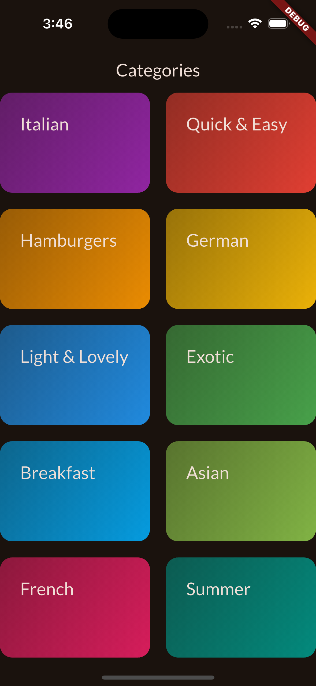
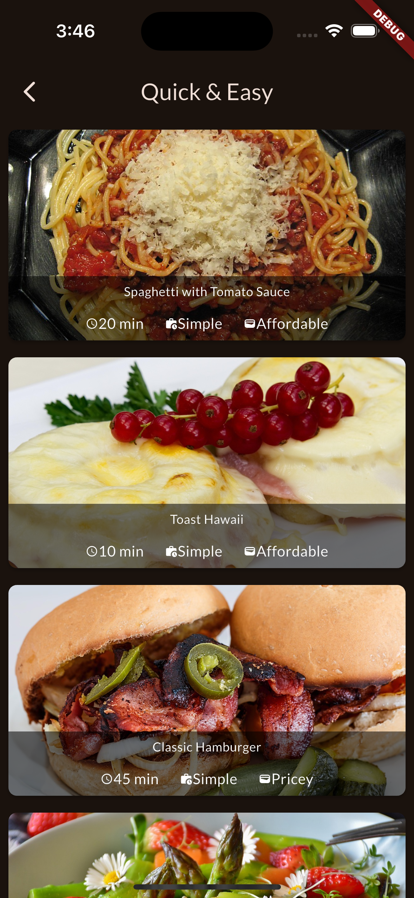
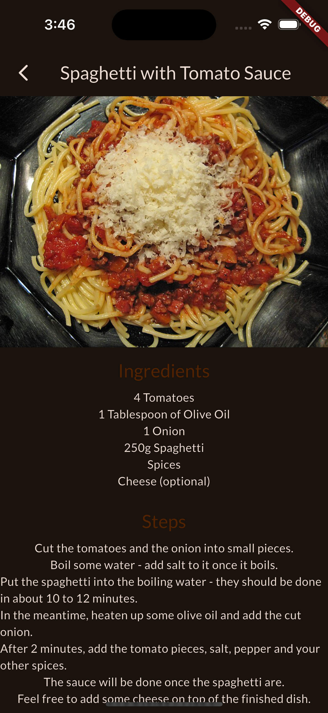

# 📱 [Flutter-Meals]

> Flutter Meals demo application, for educational purposes.

## 📋 Description

This application was create for the purpose of practicing navigation through multiple screens and simple data management

## 📱 Demo

### ScreenShots

  
  
  

## 🛠️  Technologies Used

- **Framework**: Flutter
- **Lenguaje**:  Dart 

### Prerequisites
- Flutter SDK

## 📄 License

Este proyecto está bajo la Licencia MIT - mira el archivo [LICENSE](LICENSE) para más detalles.

## 📞 Contact

**Portfolio**: [ysidroalmonte.com](https://ysidroalmonte.com)

## 🙏 Acknowledgments

- [course Flutter & Dart ](https://www.udemy.com/course/learn-flutter-dart-to-build-ios-android-apps/)

---

### 🌟 ¡If you like the project, give it a star!! ⭐

**[⬆ Back to top](#-flutter-meals)**

